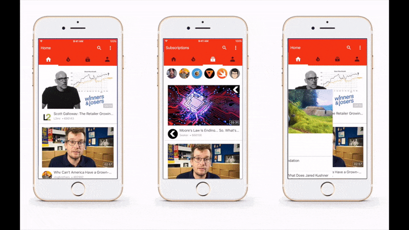

# Youtube iOS Template

Youtube iOS Template is developed by [Haik Aslanyan](https://twitter.com/aslanyanhaik) and written in Swift 3.

Purpose of this repo is to show how ViewControllers can be managed.

<h3 align="center">

</h3>

## Getting Started

All extra views are located in Navigation Controller and Main View Controller in storyboard.
<h3 align="center">

</h3>

## Compatibility

This project is written in Swift 3.0 and requires Xcode 8.2 to build and run.

Youtube iOS Template is compatible with iOS 9.1+.

## Author

* [Haik Aslanyan](https://twitter.com/aslanyanhaik)

## License

Copyright 2017 Haik Aslanyan.

Licensed under MIT License: https://opensource.org/licenses/MIT
